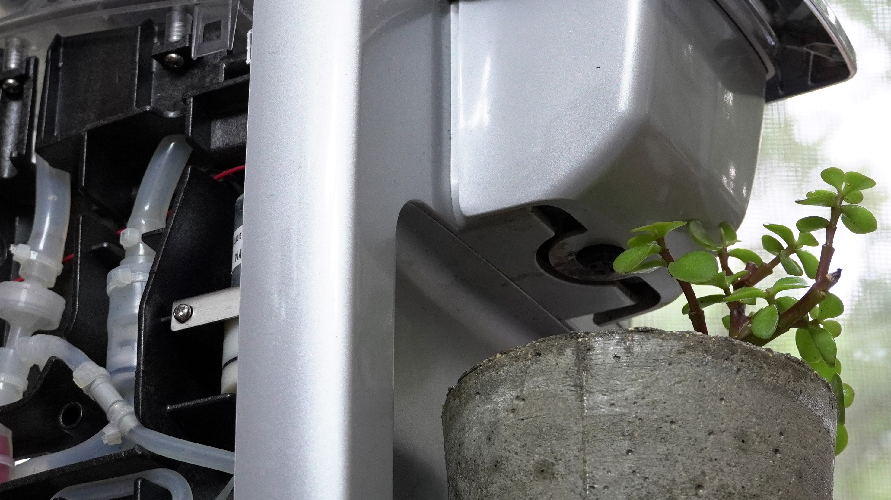

# Keurig Raspberry Pi Watering

Code/print file needed to add a Raspberry Pi controller to Keurig B31/K15.  
Article: https://www.arrow.com/en/research-and-events/articles/keurig-coffee-maker-into-a-miniature-greenhouse  
Build video: https://www.youtube.com/watch?v=-7DizpeYVRA
